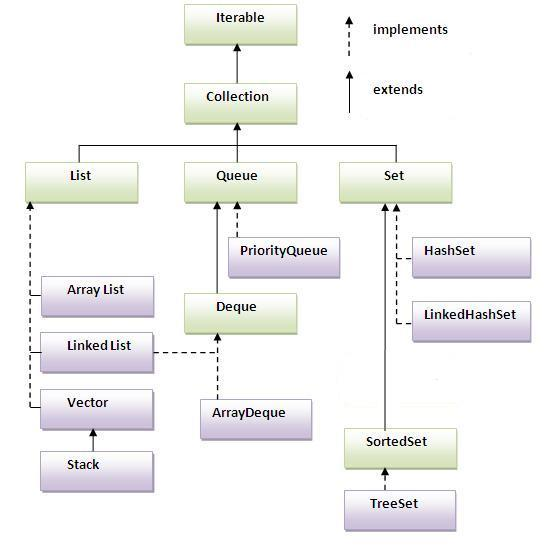

click [here](http://docs.oracle.com/javase/7/docs/index.html) for Java SE Documentation

Collections framework
=====================
* Collection(interface)
* Collections(class)
* List(interface)
* Set(interface)
* SortedSet(interface)
* NavigableSet(interface)
* Queue(interface)
* Map(interface)
* NavigableMap(interface)

#List

>Collection(I)(1.2)
 * List(I)(1.2)
   * ArrayList(C)(1.2)
   * LinkedList(C)(1.2)
   * Vector(C)(1.0)
	 * Stack(C)(1.0)
	
*Note*: 1.0-Legacy classes

**Set**:Duplicates are not allowed & insertion order is not preserved
>Collection(I)(1.2)
 * Set(I)(1.2)
   * HashSet(C)(1.2)
   * LinkedHashSet(C)(1.4)
  
**SortedSet**:If we want to represent a group of individual objects, according to some sorting order
>Collection(I)(1.2)
 * Set(I)(1.2)
   * SortedSet(I)(1.2)
  	 * NavigableSet(I)(1.6)
  	   * TreeSet(C)(1.2)
  	   
**Queue**:If we want to
 

